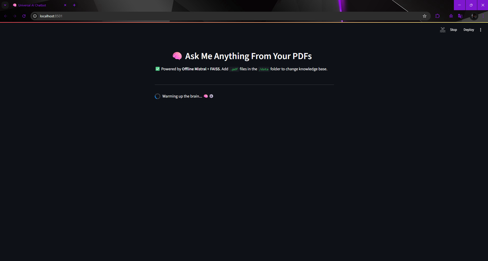
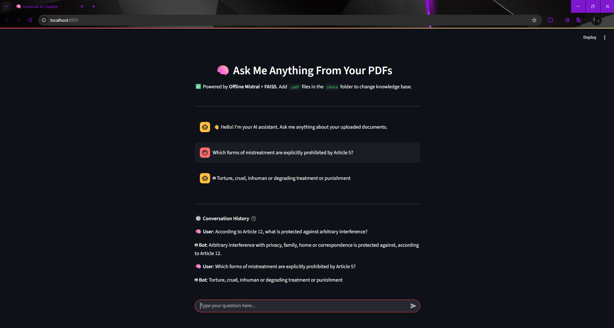

# 🌐 Universal Offline AI Chatbot

> Build your own domain-specific chatbot — offline, modular, and blazing fast.

[](https://www.python.org/downloads/release/python-3110/)


The **Universal Offline AI Chatbot** is a privacy-respecting, offline-ready assistant that can chat over **any set of PDFs**. It’s ideal for legal, cybersecurity, academic, enterprise, or technical domains.

It uses a **locally hosted LLM** (`mistral:instruct` via [Ollama](https://ollama.com)) and **semantic search** powered by HuggingFace embeddings and FAISS. You get **fast, accurate responses**, without sending anything to the cloud.

> **GitHub Link:** [https://github.com/AdityaBhatt3010/Universal-Offline-AI-Chatbot](https://github.com/AdityaBhatt3010/Universal-Offline-AI-Chatbot) <br/>
> **DockerHub Link:** [https://hub.docker.com/r/adityabhatt3010/ai-chatbot](https://hub.docker.com/r/adityabhatt3010/ai-chatbot)

---

## ✨ Highlights

* 🔐 Fully **offline-capable** with local LLM (via Ollama)
* 📄 Works out-of-the-box with your **PDFs**
* 🧠 **Semantic vector search** using `all-MiniLM-L6-v2`
* ⚡️ Fast and responsive using **FAISS** backend
* 🧩 Modular, extendable architecture (Streamlit frontend + CLI)
* 🐳 Docker-ready for deployment
* 📸 UI Preview with screenshots
* ✅ Built-in CI/CD check via GitHub Actions
* 🎯 Fully reproducible setup via PowerShell script or Docker

---

## 🧱 Tech Stack

| Layer        | Stack                                       |
| ------------ | ------------------------------------------- |
| LLM          | `mistral:instruct` via Ollama               |
| Embeddings   | `all-MiniLM-L6-v2` via SentenceTransformers |
| Vector Store | FAISS (in-memory + disk)                    |
| Framework    | LangChain (v0.2+)                           |
| Language     | Python 3.11+                                |
| UI           | Streamlit                                   |
| Container    | Docker                                      |
| CI/CD        | GitHub Actions (`.github/workflows/python.yml`) |

> ⚠️ HuggingFace Token is required to fetch the embedding model once. It's cached locally afterward.

Example `.env`:

```env
HF_TOKEN=your_huggingface_token_here
````

---

## 💡 Use Cases

| Chatbot Type        | Add These PDFs                     |
| ------------------- | ---------------------------------- |
| 👨‍⚖️ LawyerBot     | Legal, Constitution, HR documents  |
| 🧬 ResearchBot      | Whitepapers, scientific papers     |
| 🛡️ CyberSecBot     | SOC2, GDPR, ISO27001, NIST docs    |
| 📚 EdTechBot        | Notes, textbooks, question banks   |
| 🧑‍💼 HR/CompanyBot | SOPs, onboarding docs, HR policies |

---

## 📁 Project Structure

```
Universal-Offline-AI-Chatbot/
│
├── data/                   # Place your PDF documents here
│   └── Try.pdf
│
├── Screenshots/           # UI snapshots
│   ├── Loading_Screen.png
│   └── Running_the_Model.png
│
├── src/                   # Modular source code
│   ├── chunker.py
│   ├── config.py
│   ├── embedding.py
│   ├── loader.py
│   ├── model_loader.py
│   ├── prompts.py
│   ├── qa_chain.py
│   ├── utils.py
│   └── vectorstore.py
│
├── vectorstore/           # Local FAISS vector index
│   └── db_faiss/
│
├── Bot.py                 # CLI script
├── Bot.ipynb              # Jupyter notebook version
├── main.py                # Entry-point (optional)
├── streamlit_app.py       # Frontend UI (Streamlit)
├── requirements.txt       # Python dependencies
├── setup.ps1              # PowerShell setup script
├── Dockerfile             # Docker image definition
├── .dockerignore
├── .env                   # Contains HF_TOKEN
├── README.md
└── LICENSE
```

---

## 🧰 Setup Instructions

### 🖥️ One-Click Setup (Windows Only)

```powershell
.\setup.ps1
```

This will:

* Create virtual env
* Install dependencies
* Pull Mistral via Ollama
* Ask for Hugging Face token
* Build Docker image

---

### 🛠 Manual Setup

1. **Install Python Requirements**

```bash
pip install -r requirements.txt
```

2. **Install & Pull Ollama Model**

```bash
ollama pull mistral:instruct
```

3. **Set HuggingFace Token (First Time Only)**

```bash
export HUGGINGFACEHUB_API_TOKEN=your_token      # macOS/Linux
set HUGGINGFACEHUB_API_TOKEN=your_token         # Windows CMD
```

4. **Run the CLI Bot**

```bash
python Bot.py
```

---

## 🌐 Run with Streamlit Frontend

```bash
streamlit run streamlit_app.py
```

### 📸 Streamlit Preview

#### ⏳ Loading Screen



#### 🤖 Chat in Action



---

## 🐳 Docker Support

### Prerequisites

* Docker installed & running
* `.env` file containing `HF_TOKEN` (Hugging Face token)

---

### 🛠️ Docker Build & Run

To build and run the chatbot using Docker, follow these steps:

1. **Build the Docker image**:

   ```bash
   docker build -t ai-chatbot .
   ```

2. **Run the container** (with volume mount and token):

   ```bash
   docker run -p 8501:8501 --env-file .env -v ${PWD}/data:/app/data ai-chatbot
   ```

   This will:

   * Map the container's port `8501` to local `8501`
   * Use your local `.env` for `HF_TOKEN`
   * Mount the `data/` folder into the container for access to PDFs

> Access the chatbot at [http://localhost:8501](http://localhost:8501)

### 📸 Screenshot: 

#### 🐳 Building the Image


---

Let me know if you want the actual screenshot file names changed or if you’d like a quick CLI script to generate and store those screenshots automatically during your next run.


---

## 🔄 Using Your Own PDFs

```bash
# Replace default file(s)
mv your_files/*.pdf ./data/

# Re-run the bot or restart Streamlit
python Bot.py
```

Automatically re-indexes your new documents using FAISS.

---

## 🧪 Sample Interaction

```
🧠 You: What does Article 21 state?

🤖 Bot: Article 21 of the Indian Constitution guarantees the protection of life and personal liberty...
```

---

## 🧑‍💻 Author

**Aditya Bhatt** <br/>
Cybersecurity Specialist | VAPT Expert | OSS Contributor <br/>
[GitHub](https://github.com/AdityaBhatt3010) | [Medium](https://medium.com/@adityabhatt3010) <br/>

---
